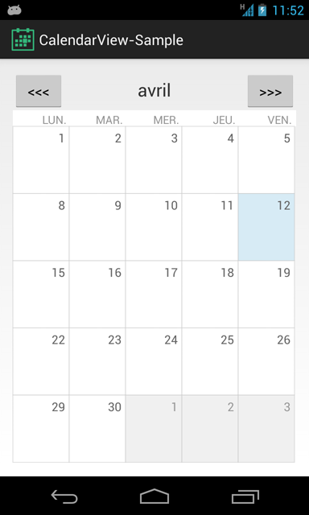

# CalendarView

This library is yet another calendar view for Android. It provide a widget to show a single month at a time, so the use with a ViewPager is much easier than showing a whole year in a ScrollView.



## Download

This library is not in Maven central yet. However, you can clone this repository, then compile and deploy it in your local repository with `mvn clean install`.

Then you could use the following maven dependency in your project :

```
<dependency>
	<groupId>fr.days.calendarview</groupId>
	<artifactId>library</artifactId>
	<version>(latest version)</version>
	<type>apklib</type>
</dependency>
```

## Usage

Include `CalendarView` in your layout XML as follows :

```
<fr.days.calendarview.CalendarView
    android:id="@+id/calendarView"
   	android:layout_width="match_parent"
   	android:layout_height="match_parent" />
```

Then set the current month in your activity :

```
@Override
public void onCreate(Bundle savedInstanceState) {
	// […]
	calendarView = ((CalendarView) findViewById(id.calendarView));
	calendarView.setCurrentMonth(YearMonth.now());
}
```

## Logs

If `verbose` logs are not displayed in Eclipse's Logcat view, run the following command in a terminal : `adb shell setprop log.tag.CalendarView VERBOSE`